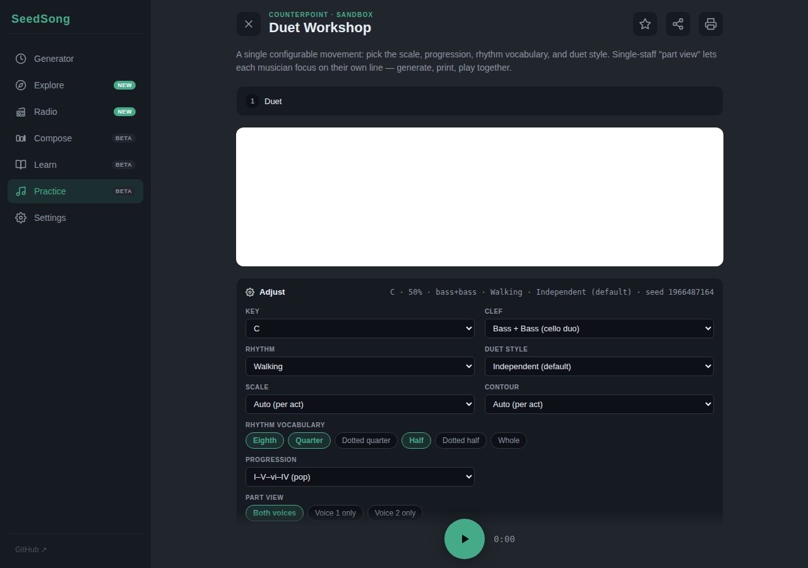

# SeedSong

**An infinite shelf of sheet music. Turn a number into a playable piece — at your level, for your instrument, in your clef.**

[Try it live](https://chicomcastro.github.io/procedural-music-generator-web/) — no install, no sign-up.

SeedSong is a practice-first tool for amateur musicians — especially pairs who practice together. Every piece is generated procedurally from a seed number and rendered as real, printable sheet music. Same seed, same piece: share a link and your duo partner opens the exact same score. No practice session ever repeats the last one.

See [ADR 0005](docs/adr/0005-product-vision-practice-first.md) for the product vision.



## What you can practice

- **Duet Workshop** — a fully configurable two-voice duet: pick the scale, the chord progression, the allowed note values (quarter/half/eighth…), the duet style (parallel thirds/sixths, contrary motion, call & response) and the clef pair (cello duo, violin + cello, …). Single-part view lets each player read only their own line while the audio plays both.
- **Two-voice Invention** — a structured 3-movement melody + counterpoint piece in the Bach inventions tradition.
- **Walking-Bass Workout** — walking lines over real changes (ii–V–I, 12-bar blues), escalating tempo.
- **Scale Etude** — method-book patterns (pairs and threes, ascending + descending) built into one continuous piece.
- **Solo Etude & Modal Vamp** — single-voice melodies over changes, and modal color training.

Every study has: difficulty dial, key/scale/clef pickers, seed reroll, favorites, print/PDF, and share URLs that reproduce the exact piece.

**Learn** ships a companion theory track — bite-sized modules on scales, triads, progressions and counterpoint with audio examples and rendered notation.

**Generator** is the engine playground: the raw procedural composer (melody, chords, bass, drums) with a piano-roll score canvas, mixer, and multi-track MIDI + WAV export. Everything Practice generates runs on this engine.

## How it works

- **Seed-based generation** — a seedable PRNG drives a weighted Markov walk over scale tones with chord-tone bias, contour and rhythm templates. Deterministic: same parameters, same piece.
- **Real notation** — pieces render as MusicXML via OpenSheetMusicDisplay, calibrated to each clef's playable range (cello, viola, violin friendly).
- **Runs entirely in the browser** — Web Audio API, vanilla JS, zero runtime dependencies, everything stored locally.

## Run locally

The app loads samples via `fetch`, so it needs an HTTP server:

```bash
cd src && python3 -m http.server 8000
```

Then open [http://localhost:8000](http://localhost:8000).

## Development

```bash
npm install            # one-time
npm run lint           # ESLint
npm run typecheck      # tsc --noEmit (validates module resolution + syntax)
npm run test:unit      # Vitest — unit + integration suite
npm run build          # produces dist/ ready to deploy
npm run serve          # http-server on port 8080 (used by Cypress)
npm run test:e2e       # full Cypress run against the served app
npm run ci             # lint + typecheck + unit + build (mirrors the CI job)
```

CI runs on every push and PR to `main`:

| Job | What it does |
| --- | --- |
| **static** | `npm ci` → lint → typecheck → build → uploads `dist/` artifact |
| **unit** | Vitest run (`test:unit`) |
| **e2e** | Cypress against the built app (auto-starts the server) |

## Architecture

Vanilla JS with ES modules. No bundler, no framework, no dependencies — by design ([ADR-002](docs/decisions.md#adr-002--no-bundler-no-third-party-dependencies)).

```
src/js/
  audio/      AudioContext, sample loading, voices, effects, click
  theory/     Notes, scales, chords (pure functions)
  scheduler/  Lookahead scheduler + transport
  generate/   Progression, rhythm, melody, counterpoint, song (seedable PRNG)
  export/     MIDI (Format 1 multi-track) + WAV (16-bit PCM) + MusicXML
  ui/         Practice studies, Learn modules, piano, score canvas, theme
```

Product and architecture decision records live in [`docs/adr/`](docs/adr/) and [`docs/decisions.md`](docs/decisions.md).

> **Note on hidden areas**: Explore, Radio and Compose left the navigation under [ADR 0005](docs/adr/0005-product-vision-practice-first.md) but their routes still work (`#/explore`, `#/radio`, `#/compose`) — code is kept until confirmed unmissed.
